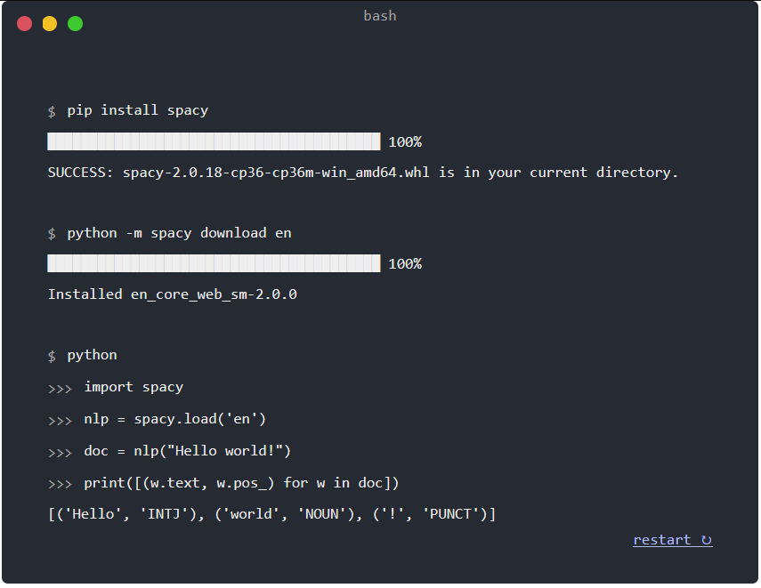

# React-Termynal-New

`react-termynal-new` is another react wrapper around the css/javascript library [termynal.js](https://github.com/ines/termynal).

## Installation

```bash
npm install react-termynal-new
```

## Usage

```jsx
import React from 'react';
import {App as Termynal, DataLine} from 'react-termynal-new';

const App = () => {
  return (
    <Termynal>
      <DataLine type="input">pip install spacy</DataLine>
      <DataLine type="progress"></DataLine>
      <DataLine>SUCCESS: spacy-2.0.18-cp36-cp36m-win_amd64.whl is in your current directory.</DataLine>
      <DataLine></DataLine>
      <DataLine type="input">python -m spacy download en</DataLine>
      <DataLine type="progress"></DataLine>
      <DataLine>Installed en_core_web_sm-2.0.0</DataLine>
      <DataLine></DataLine>
      <DataLine type="input">python</DataLine>
      <DataLine type="input" prompt=">>>">import spacy</DataLine>
      <DataLine type="input" prompt=">>>">nlp = spacy.load('en')</DataLine>
      <DataLine type="input" prompt=">>>">doc = nlp("Hello world!")</DataLine>
      <DataLine type="input" prompt=">>>">print([(w.text, w.pos_) for w in doc])</DataLine>
      <DataLine type="output">[('Hello', 'INTJ'), ('world', 'NOUN'), ('!', 'PUNCT')]</DataLine>
    </Termynal>
  );
};

export default App;
```



## Props


### App
| Prop            | Type           | Default    | Description                                          |
|-----------------|----------------|------------|------------------------------------------------------|
| id              | string         | `termynal` | The id of the terminal                               |
| title           | string         | `bash`     | The title of the terminal                            |
| flex            | boolean        | `false`    | Whether to make height of terminal flexible          |
| startDelay      | number         | `600`      | The delay before the terminal starts typing          |
| typeDelay       | number         | `90`       | The delay between each character typed in input line |
| lineDelay       | number         | `1500`     | The delay between each line                          |
| progressLength  | number         | `40`       | The length of the progress bar                       |
| progressChar    | string         | `█`        | The character to use for the progress bar            |
| progressPercent | number         | `100`      | The percentage of the progress bar to fill           |
| cursor          | string         | `▋`        | The character to use for the cursor                  |
| children        | ReactElement[] | `[]`       | The lines to render in the terminal                  |


### DataLine

| Prop            | Type   | Description                                                                  |
|-----------------|--------|------------------------------------------------------------------------------|
| type            | string | The type of the element. Can be 'input', 'progress', or '' as pure text line |
| cursor          | string | The character to use for the cursor                                          |
| value           | string | The value of the element                                                     |
| delay           | number | The delay before the element is rendered                                     |
| typeDelay       | number | The delay between each character typed in input line                         |
| prompt          | string | The prompt to use for input lines                                            |
| progressLength  | number | The length of the progress bar                                               |
| progressChar    | string | The character to use for the progress bar                                    |
| progressPercent | number | The percentage of the progress bar to fill                                   |
